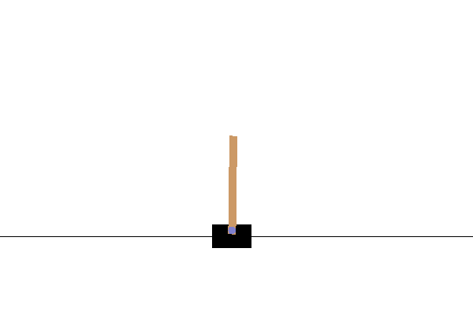
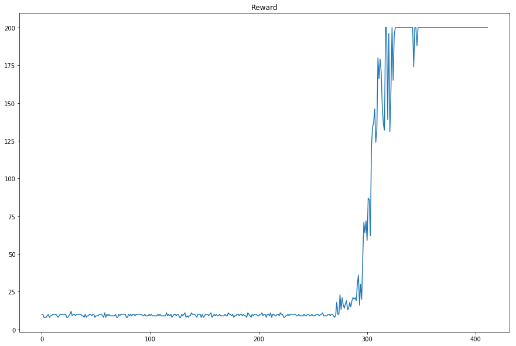
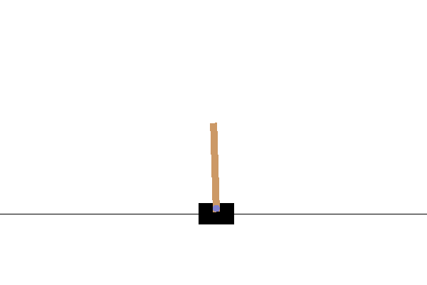
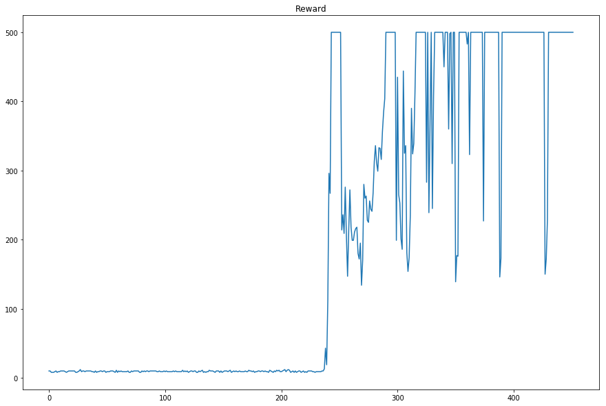
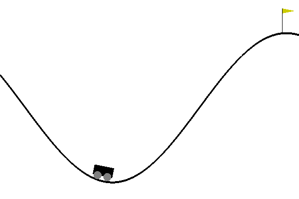
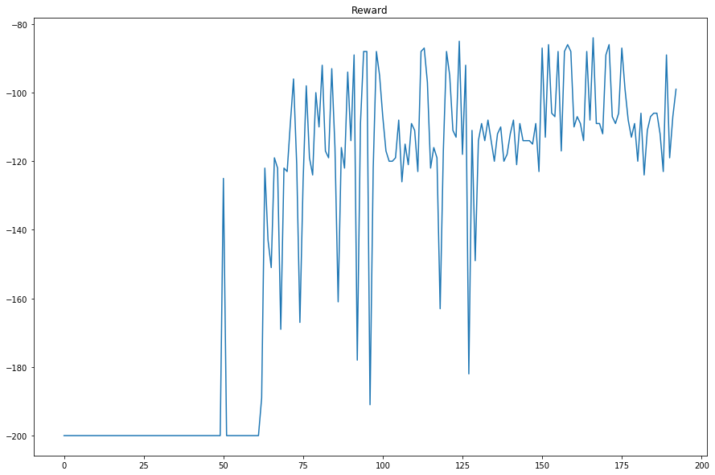
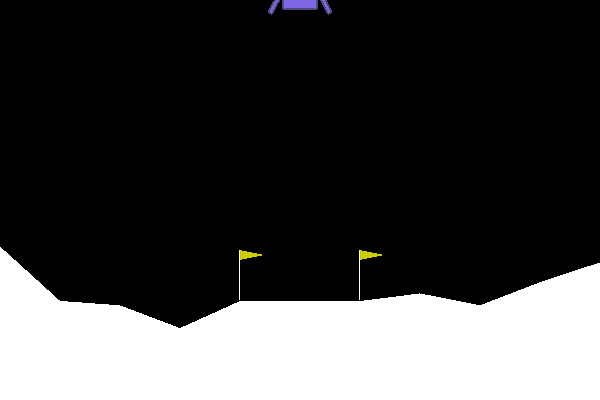
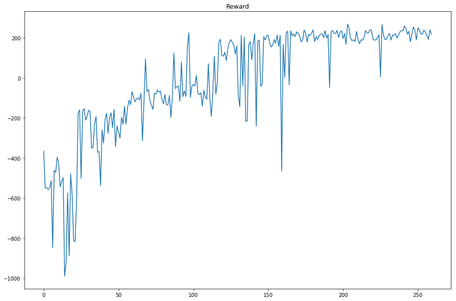

## Deep RL Algorithms in PyTorch

### Models
- DQN
- Dueling Double DQN
- Categorical DQN (C51)
- Categotical Dueling Double DQN
- Proximal Policy Optimization (PPO)
	+ discrete (episodic, n-step)
- Soft Actor-Critic (SAC)
	+ debugging
 

### Exploration
- Random Network Distillation (RND)
 

### Experiments
The result of passing the environment-defined "solving" criteria.
- **Dueling Double DQN**
	+ Only one hyperparameter "UP_COEF" was adjusted.
###### CartPole-v0

  

###### CartPole-v1

  

###### MountainCar-v0

  

###### LunarLander-v2

 
  

 

### TODO
- Quantile Regression DQN (QR DQN)
- Implicit Quantile Networks (IQN)
- Intrinsic Curiosity Module (ICM)
- Rainbow
- Parametric DQN
- Proximal Policy Optimization (PPO)
	+ continuous
- Deep Deterministic Policy Gradient (DDPG)
- MCTS Net
- Parallel Models 
	+ Ape-X
	+ R2D2
	+ PAAC
